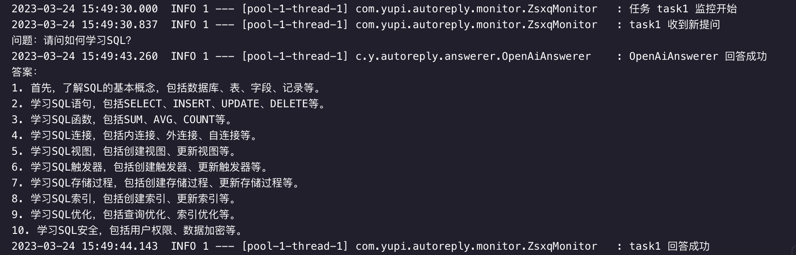
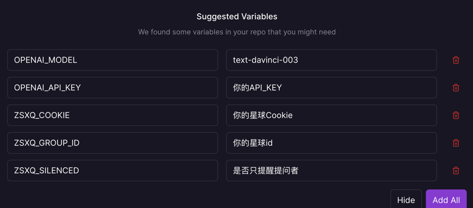
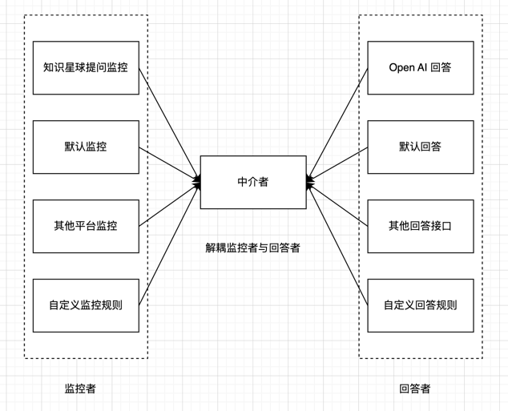
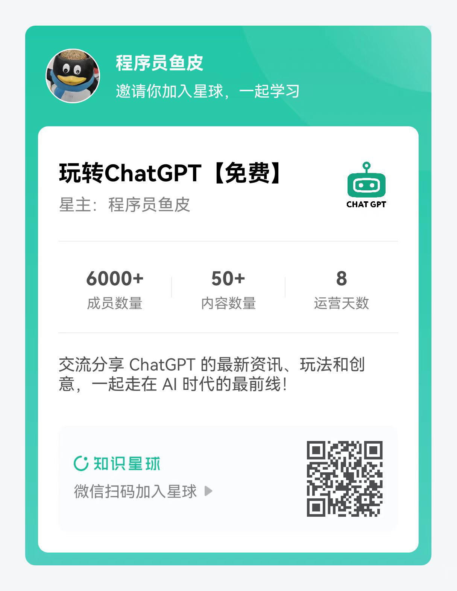

# yu-auto-reply 自动回复

> 作者：[程序员鱼皮](https://github.com/liyupi)
> 
> 编程学习圈：[编程导航知识星球](https://yupi.icu)

[toc]

基于 Java Spring Boot 的平台监控及自动回复工具，支持灵活地配置多个监控任务，支持一键部署！

演示视频：https://www.bilibili.com/video/BV1WX4y1o7aL



本项目采用多种设计模式，解耦监控者及回答者，可以灵活配置多个不同平台的监控，并绑定不同类型的自动回复。

🙏🏻 大家喜欢这个项目的话，感谢动手点点 star，后面作者可能会官方提供更多的平台监控支持。

## 功能特性

### 监控能力

- 知识星球提问监控
- 默认监控（模拟数据）

### 回复能力

- OpenAI 回答（支持自选模型，比如 gpt-4）
- 默认监控（模拟数据）

### 配置能力

- 支持配置多个任务
- 每个任务可以灵活指定监控和回答方式

### 部署能力

- 支持 Docker 容器化部署
- 支持 Railway 一键部署
- 支持动态指定环境变量来改变配置

## 快速启动

1）修改 `application.yml` 配置，主要包含 3 部分：

- openAI 配置（需要有一个 API Key）
- 知识星球配置（需要自行获取 cookie）
- 任务配置

详细配置如下：

```yml
# openAI 配置
# https://platform.openai.com/docs/api-reference
openai:
  model: ${OPENAI_MODEL:text-davinci-003}
  apiKey: ${OPENAI_API_KEY:你的apiKey}
# 知识星球配置
# https://zsxq.com/
zsxq:
  cookie: ${ZSXQ_COOKIE:你的星球cookie}
  groupId: ${ZSXQ_GROUP_ID:你的星球id}
  # 是否提醒提问者
  silenced: ${ZSXQ_SILENCED:true}
# 任务配置
task:
  # 任务列表，支持配置多个
  list:
    - name: task1 #任务名
      monitor: zsxq #监控者
      answerer: openai #回答者
      cron: '0/30 * * * * ?' #执行周期
```

2）直接运行主类 `MainApplication` 即可

## 一键部署

[](https://railway.app/template/BMJMMm?referralCode=tKgj86)

点击上述部署按钮后，会自动识别环境变量，改成自己的就可以了：



## 架构设计

一图胜千言：



本项目最关键的设计就是在于 **解耦监控者与回答者** ，你可以监控任何平台，并且给每个平台绑定不同的自动回答（比如 OpenAI）。

实现关键：

1. 定义 Answerer 回答者接口，统一回答的方法
2. 定义 Monitor 监控者接口，统一监控的方法，通过 Answerer 回调参数实现对监控到的消息进行自动回复
3. 使用中介者模式，用 JobMediator 类组合 Monitor 和 Answerer，而不是把回答者和监控者强绑定
4. 使用工厂模式，根据配置生成监控者和回答者
5. 使用 Spring Scheduler，读取 yml 配置来自动创建多任务

## 开发

### 自定义监控

1）编写一个类，实现 `monitor/Monitor` 抽象类

2）修改 `factory/MonitorFactory` 的 `createMonitor` 方法，补充创建你自己的监控者

### 自定义回答

1）编写一个类，实现 `answerer/Answerer` 接口

2）修改 `factory/AnswererFactory` 的 `createAnswerer` 方法，补充创建你自己的回答者


## 免费 ChatGPT 交流群




## 欢迎贡献

**作者平时非常忙** ，本项目也是仅用了几个小时抽空做的，开源出来给大家参考，但是 PR 和 Issues 响应不会很及时，感谢理解！

如有项目本身的问题，欢迎提 issues 和 PR；

如有编程方面的问题、或者需要项目教学，请看 [编程导航知识星球](https://yupi.icu)


## 问答

1）问：为什么先支持知识星球？

答：因为 OpenAI 的 API 不是免费的，星球可以限制提问次数，防止刷接口
